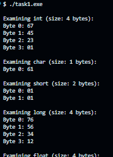

# CS333 - Project 1 - README

### Mickey Zhang

### 02/07/2026

**Google Sites Report: https://sites.google.com/colby.edu/mickeys-cs333/home**

## Directory Layout:

```
proj01/
|
|__/assets/
|  |
|__|__|ctask1.png
|__|__|ctask2.png
|__|__|ctask3.png
|__|__|ctask4.png
|__|__|ctask5.png
|
|__/C/
|  |
|  |__/task1.c
|  |__/task2.c
|  |__/task3.c
|  |__/task4.c
|  |__/task5.c
|
|__/JS/
|  |
|  |__/task1.js
|  |__/task2.js
|
|__/RUST/
|  |
|__|__/task1.sql
|__|__/task2.sql

```

## OS and C compiler

OS: Windows
C compiler: MinGW-W64 x86_64-ucrt-posix-seh

## Part I

### Task 1

```bash
//compile
gcc -o task1 task1.c

//run
./task1.exe
```

**Output:**

**1.a** 

**1.b** Is the machine you are using a big-endian or little-endian machine? --> little endian

**1.c** How does the program output tell you? --> the program prints out the least significant first and increases from there

**2.a**
**2.b**
**2.c**

### Task 2

... Other C tasks are there ...

_Please note that you don't need Part II for Project 1 as it doesn't require you to write any programs. However, you are expected to include Part II for future projects to illustrate how to compile and run your selected language programs and the outputs you get from them._

## Part II - JS

###task 1
**Compile:**

**Run:**

**Output:**

###task 2
**Compile:**

**Run:**

**Output:**

... Other selected language tasks are there

_Please have a description of each extension you undertook_

## Extensions

###extension 1
**Description**

**Compile:**

**Run:**

**Output:**

###extension 2
**Description**

**Compile:**

**Run:**

**Output:**
