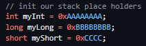
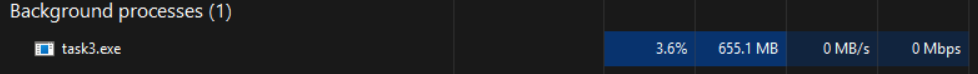
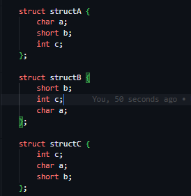
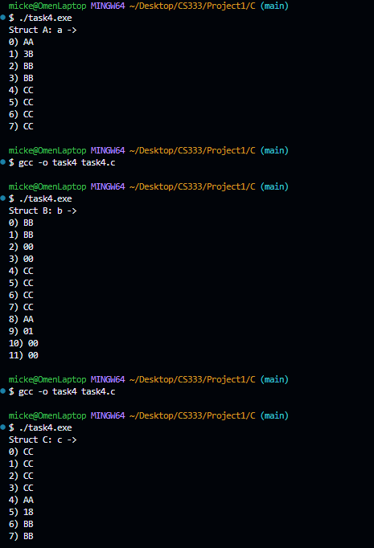
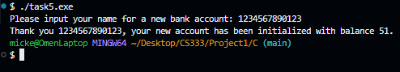
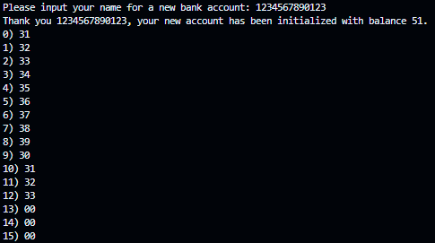

# CS333 - Project 1 - README

### Mickey Zhang

### 02/07/2026

**Google Sites Report: https://sites.google.com/colby.edu/mickeys-cs333/home**

## Directory Layout:

```
proj01/
|
|__/assets/
|  |
|__|__|ctask1.png
|__|__|ctask2.png
|__|__|ctask3.png
|__|__|ctask4.png
|__|__|ctask5.png
|
|__/C/
|  |
|  |__/task1.c
|  |__/task2.c
|  |__/task3.c
|  |__/task4.c
|  |__/task5.c
|
|__/JS/
|  |
|  |__/task1.js
|  |__/task2.js
|
|__/RUST/
|  |
|__|__/task1.sql
|__|__/task2.sql

```

## OS and C compiler

OS: Windows
C compiler: MinGW-W64 x86_64-ucrt-posix-seh

## Part I

### Task 1

```bash
//compile
gcc -o task1 task1.c

//run
./task1.exe
```

**Output:**

**1.a.**


**1.b.** Is the machine you are using a big-endian or little-endian machine? --> little endian

**1.c.** How does the program output tell you? --> the program prints out the least significant first and increases from there

### Task 2

```bash
//compile
gcc -o task2 task2.c

//run
./task2.exe
```

**2.a.**


**2.b.** The layout of the stack seems to be the most recently pushed items being closer to index 0. It reads backwards which makes sense because we've established that the machine is little endian

**2.c.** at indicies 8 and 9 it's 0x0032 I have no idea what that is. There's also other memoryt addresses after our variable inits. Indicated by the 0x000000... sequence.

**2.d.** Yes, I initiated 3: int, long, short. We found them from indicies 10-19 with myInt starting at index 19 (sequence of AAs) and working backwards towards myShort (sequence of CCs) towards index 10



### Task 3

```bash
//compile
gcc -o task3 task3.c

//run
./task3.exe
```

**3.a**



**3.b** The activity shows that once I run my .exe file, the program allocates quite a bit of memory. The loop is continuously reserving space without freeing itself from the previous space so we get memory leakage. With free(), it's essentially always freeing up the space it used on each iteration.

### Task 4

**4.a** I'd say 8 bytes makes sense since our original was 7 bytes and we need 1 extra for padding. The 12 bytes caught me off guard for when we moved the int var in the middle.





**4.b** for structA and structC, the gaps were at the ends to ensure that the final struct was padded to 8 bytes. The major gap was in structB where the number of bytes went up to 12

### Task 5

**5.a** A string of size 13 chars => 12 chars might bet he cut off



**5.b**



**5.c** Upon closer inspection. The name field in the struct Account only holds 10 characters all of size 1 so the indices 0-9 show the name of our account. Since integers need to start on a mutliple of 4 because of their size constraint, the machine padded indicies 10-11 with the overflow after the 9th index. Then the int is recorded from indicies 12-15 0x00000033 which is 51 => same as the balance which means that the balance is carryong over the extra bits from name.

## Extensions

###extension 1
**Description**

**Compile:**

**Run:**

**Output:**

###extension 2
**Description**

**Compile:**

**Run:**

**Output:**
