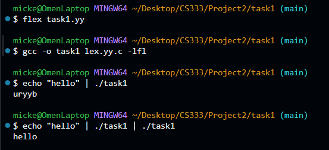
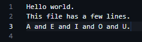
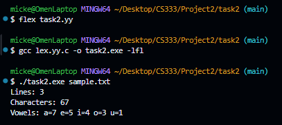
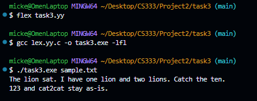
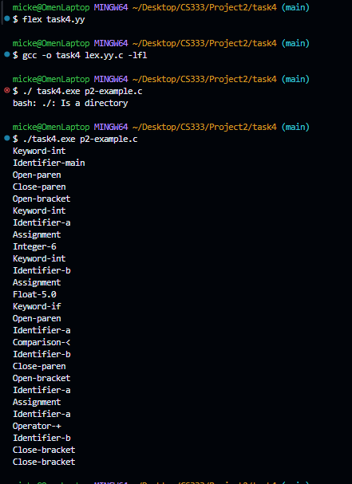

# CS333 - Project 2 - README

### Mickey Zhang

### 02/07/2026

**Google Sites Report: https://sites.google.com/colby.edu/mickeys-cs333/home**

## OS and C compiler

OS: Windows
C compiler: MinGW-W64 x86_64-ucrt-posix-seh

## Part I

### Task 1

**Output:**

**1)** We define a flex source in task1.yy which defines the rules for our lexical scanner when we run flex task1.yy. After we get the lexical scanner, we compile it as a executable that can then take string input via terminal to rotate each character by 13 ascii values

### Task 2

**Output**

**2.a.** A Flex program that reads a text file (or stdin) and reports the number of lines, total characters, and the count of each vowel [a, e, i, o, u] (case-insensitive). **Pattern-matching:** We use one rule per vowel ([aA], [eE], etc.) to increment both the global character count and that vowel’s counter; a rule for newline \n increments the line count and character count; a catch-all . counts any other character. On end-of-file "EOF" or end of file, we print the totals (and treat a file with no newline as 1 line). Build: flex task2.yy then gcc lex.yy.c -o task2.exe. Run: task2.exe sample.txt or task2.exe < sample.txt.

### Task 3

**3.a** Prose editor: (1) Replace whole words "cat"/"cats" (case-insensitive) with "lion"/"lions"—using lookahead /[^a-zA-Z0-9] so we don’t replace inside words like "Catch" or "category". (2) Replace standalone digits 0–9 and the number 10 with words (zero, one, … ten)—same lookahead so "123" and "cat2cat" stay unchanged. All other text is echoed. Build: flex task3.yy then gcc lex.yy.c -o task3.exe. Run: task3.exe sample.txt.

### Task 4

**4.a** Clite lexer: a Flex program that reads a Clite source file and prints one line per token. **Token types:** Integer-&lt;value&gt;, Float-&lt;value&gt;, Keyword-&lt;word&gt; (if, else, while, for, int, float), Identifier-&lt;name&gt;, Assignment (=), Comparison-&lt;symbol&gt; (==, &lt;, &gt;, &lt;=, &gt;=), Operator-&lt;symbol&gt; (+, -, _, /), Open-bracket, Close-bracket, Open-paren, Close-paren. **Pattern-matching:** Rule order matters. Whitespace and comments (// and /\* \*/) are matched first and skipped. Keywords are matched with trailing context /[^a-zA-Z0-9_] so "if" is a keyword but "iffy" is an identifier. Float is matched before Integer so "3.14" becomes one Float token (pattern [0-9]+\.[0-9]+). Comparisons put longer forms first (==, &lt;=, &gt;= then &lt;, &gt;) so "==" is one token. Identifiers use [a-zA-Z\_][a-zA-Z0-9_]\_. **Example (Float):** The pattern [0-9]+\.[0-9]+ matches one or more digits, a literal dot, then one or more digits; the matched text is in yytext, so we print "Float-%s\n", yytext and get e.g. "Float-3.14". **Build:** flex task4.yy then gcc lex.yy.c -o task4.exe. **Run:** task4.exe sample.cl. Include an image of the terminal showing flex, gcc, and the program run on the test example.

## Extensions

### Extension 1:

**Description**

**Output:**

### Extension 2

**Description**

**Output:**

1.  
