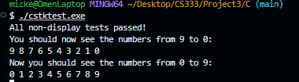
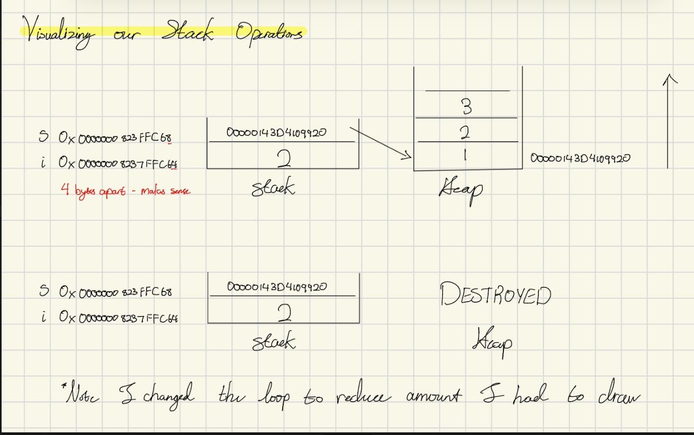

# CS333 - Project 3 - README

**Project identifier:** Project 3 – C Stack & Selected Languages  
**Name:** Mickey Zhang  
**Submission date:** March 12, 2026

**Google Sites report:** https://sites.google.com/colby.edu/mickeys-cs333/home

---

## OS and C compiler

- **OS:** Windows
- **C compiler:** MinGW-W64 x86_64-ucrt-posix-seh

---

## Project Tree

```
Project3/
├── README.md
├── assets/                    # Screenshots and images for report
├── C/                         # Part I – C stack implementation
│   ├── cstk.h                 # Stack structure and function declarations
│   ├── cstack.c               # Stack implementation (cstk.c)
│   ├── cstktest.c             # Test program for the stack
│   ├── toDraw.c               # Code for stack/heap memory diagrams (Mark 1 & 2)
│   ├── extension2.c           # Extension: auto-expanding stack + extra functions
├── RUST/                      # Part II – Rust
│   ├── Cargo.toml
│   ├── Cargo.lock
│   ├── rustfmt.toml
│   └── src/
│       ├── main.rs
│       ├── task1.rs           # Identifiers, declarations, scoping
│       ├── task2.rs           # Binary search
│       └── task3.rs           # Types and operators
└── TS/                        # Part II – TypeScript (extension / second language)
    ├── package.json
    ├── tsconfig.json
    ├── task1.ts               # Identifiers, declarations, scoping
    ├── task2.ts               # Binary search
    └── task3.ts               # Types and operators
```

---

## Part I: C syntax (stack)

### Compile and run

**Stack test (cstktest):**

```bash
cd C
gcc -o cstktest cstktest.c cstack.c
./cstktest
```

**toDraw (address printing for memory diagrams):**

```bash
cd C
gcc -o toDraw toDraw.c cstack.c
./toDraw
```

### First Deliverables

- **cstk.h** – `Stack` struct and declarations for `stk_create`, `stk_empty`, `stk_full`, `stk_push`, `stk_peek`, `stk_pop`, `stk_display`, `stk_destroy`, `stk_copy`.
- **cstack.c** – Implementation of the above functions.
- **cstktest.c** – Provided test program; all tests should pass.

## Outputs

### Output for cstktest.exe



### Drawing of Mark 1 and Mark 2



## Part II: Syntax of selected languages

### RUST

Part II (code, output, explanations): https://sites.google.com/colby.edu/mickeys-cs333/home

- **Task 1:** Identifiers, `let`/`mut`, block scope, shadowing.
- **Task 2:** Binary search on a slice; returns `Option<usize>`.
- **Task 3:** Built-in types, operators (`+ - * / %`), `struct`, result types.

**Run:** From `RUST/`, `cargo run --bin task1`, `cargo run --bin task2`, `cargo run --bin task3`.

### TS

- **Task 1:** Identifiers, `let`/`const`, block scope, shadowing.
- **Task 2:** Binary search on an array; returns index or `null`.
- **Task 3:** Built-in types, operators, `interface`, result types.

**Run:** From `TS/`, `npx ts-node task1.ts`, `npx ts-node task2.ts`, `npx ts-node task3.ts`.

## Extensions

### Extension 1: Second language (TypeScript)

Part II tasks implemented in TS; see Google Sites for sections and outputs.

### Extension 2: Robust stack (`extension2.c`)

- **What:** Stack that **auto-expands** on overflow (doubles capacity) instead of failing; plus extra library-style functions: `estk_size`, `estk_clear`, `estk_copy`, `estk_shrink_to_fit`.
- **Compile/run:**
  ```bash
  cd C
  gcc -o extension3 extension3.c
  ./extension3
  ```
- **Output:** Pushes 1..10 with initial capacity 2 (demonstrates growth to 16), pops, then demonstrates clear and copy.
